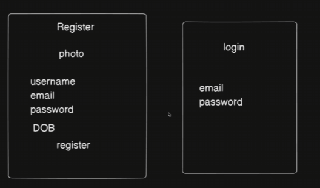
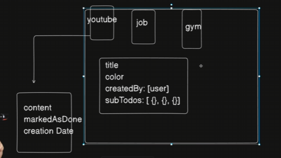

# Data modelling for backend with mongoose

> TIT_BIT>> WHen asked to write an Authentication freshers will start writing controllers as compared to an experienced person who will first think of all the things like what is the scope what data will be there how to this and that

What data need to be stored where it is stored is not the primary requirement. Basically `modelling` like how many fields and what those field contains. 

There are proffessional tools, basic tools and different type of things to make it easier. 

We will be using `mongoose` to do modelling for node.js
other tools can be `DATENSEN- Moon Modeler` - this is used for modelling in mongoose and mongoDB

we also do the schema of the project. we can use tools like `Eraser` for it or a professional software. `in Eraser we can use diagram as a code where we can do this` this has a different syntax than the moon modeler. 

First pen down all the data points we will need

#### 
data_points

#### 
to_do app outline

We have so called helpers (i.e Prisma and Mongoose) to help us do these kind of Modellings.

-- (19:40) Phase 2 --

- We can use certain tools to have enviornment predone like `Stackblitz`
- we use a nomenclature for writing file names `user.models.js` this is still a core JS file. 