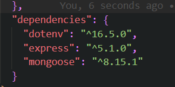

# How to connect database in MERN with debugging

Note: Better understanding will occur when actually are connecting it. but just a overview for now 

we will learn about how to connect databases and will go in depth with that. There are multiple ways to do it. 

we will be using a cloud hosted database from `mongoDB (Atlas Database)`to do this. Atlas is a subservice which gives us a shared database. 

We will use .env package as well from npm which we will use to store PORT of some sensitive information like the login and password of the connection to the DB

mongoose and express as well

There are different type of pedagogy one con be that we can directly write all the code in the index.js which is the entry point to out backend code or we can break the code in modular for or `modules` like we can have a index in DB related to connection of DB ( mongoDB Atlas) to the code and have constants in the constant folder and from there we can inport both of them or direct them from index which is the entry point 2nd approach is better as it break the code making it more readable.



We will use mongoose to connect to the Database. it is using. 
```mongoose
    mongoose.connect('mongodb://127.0.0.1:27017/test');

```
But it is not as simple as that. when connecting with the Databse there is a highly likeley chance that we will come across a problem

### When handling Databases we can come acrosss problem
1. so it is important that we wrap them in try and catch that is the better approach.
2. Database is always in another continent so it may take time to respond so instand expectation of response will produce failure. we will use async await as it takes time to interact with DB. 
3. Never connect DB in one line use the above concepts to make the code more reliable. 


* we have to restart the file if we make changes to the .env as nodemon dont wont then. 
## Read your fucking errors and understand them