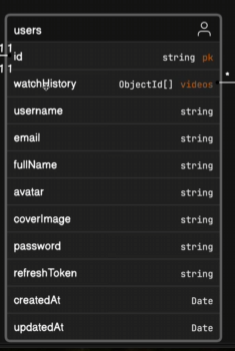

Will will be writing code for two models which are interrelated with each other. 
We first write models which are independent and then build on the relations.
here we will start with user and whe wont be writing the id as it os done by MongoDB using a BSON file.

we have an attribute in users which is watchHistory which makes this part complex and interesting so we will use aggregation pipline to handle it for that we will use `mongoose-aggregate-pipeline-v2` package

We can write middleware in mongoose you can read on mongoose middleware

we can also add plugins and aggregate was later used so we use .plugin to use this 
we will also use `bcrypt` or `bcryptjs` use to hash passwords
we `jwt` for tokens both are based on crpytography
we cannot directly do encrpyption so we hooks more specifically prehooks from mongoose 