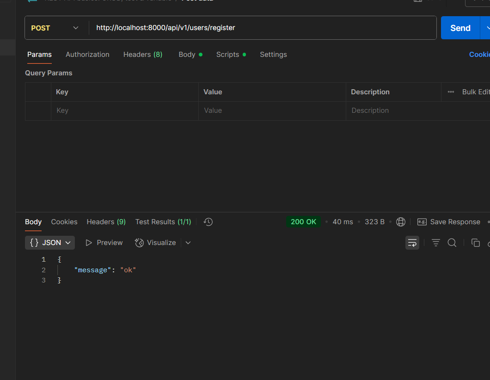

# Complete guide for router and controller with debugging

* Develop a problem solving mindset breaking bigger probelm in the smaller problems.

We will user ThunderClined for Vscode and other option is postman (this is industry standard) we will use these for APIs

type of request is also important it wont work otherwise obviously
we can do datahandling through this and for file handing we will use multer