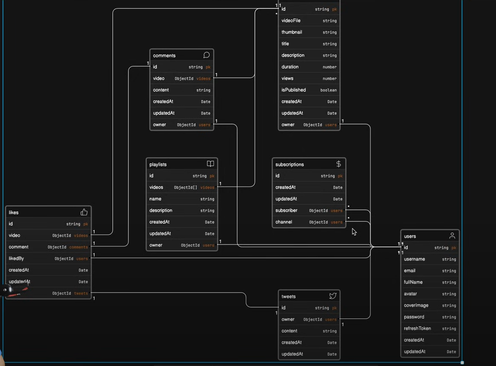
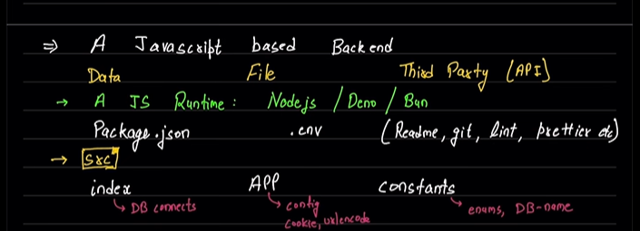

# Backend Development
### RoadMap

-> Servers in these cases are softwares which serve rather than large hardware computers.
-> Backend development is divided in two major sections `A programming language` (Java, `JavaScript(node)`, Golang, PHP) used for logic and `A Database` (`MongoDB`, MySQL, postgreSQL, sqlite) used for storage. 
-> NodeJS has little to do with Backend as a whole and whatever there is will be covered here. it has its own use case (JS runtime).
-> for ease of work we will use one framework (Express) for programming language and a ORM/ODM (Mongoose) for a Database.

### Javascript Based Backend
as we are working in JS based backend so we will be using two tools/ frameworks primarily. those are Express and Mongoose. 

Here we can get the data in any of the three forms
* Data
* File
* Third Party(APIs)
  
There are multiple JS Runtime Environments we can use for backend
* NodeJS
* Deno
* Bun

File Structure
* package.json
* .env
* Readme,.git,lint,prettier

-- Src (directories)
    --index (DB connects and entry point) (files)
    --App (config, cookies, urlencoder)
    --constants (enums,DB_Names)

(22:23 mins - [Video](https://www.youtube.com/watch?v=7fjOw8ApZ1I))
-- DB
-- Modals
-- Controller
-- Routes
-- Middleware
-- Routes
-- Utils
-- More(depends)

