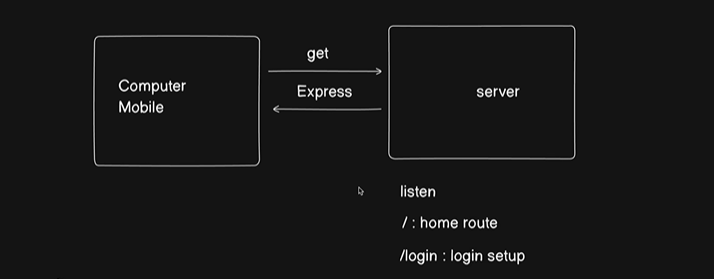

# How to deploy backend code in production

for example if we visit a site then there is something always `listen`ing and it provides us the website page as `response`

when we visit the main page it is called `/: home route`
likewise there are different types of routes like `/login: login route`
-> This `listen` thing is done by `Express` 

-> we will use `npm init` to create a `package.json` for this project and configure it in the terminal
This utility will walk you through creating a package.json file.
It only covers the most common items, and tries to guess sensible defaults.