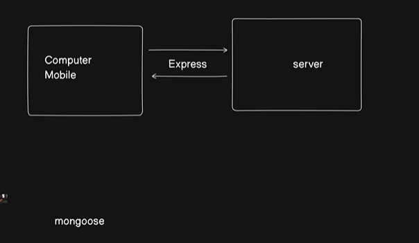
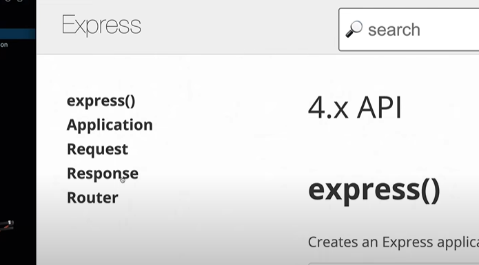
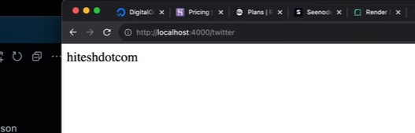

# How to deploy backend code in production



for example if we visit a site then there is something always `listen`ing and it provides us the website page as `response`

when we visit the main page it is called `/: home route`
likewise there are different types of routes like `/login: login route`
-> This `listen` thing is done by `Express` 


-> we will use `npm init` to create a `package.json` for this project and configure it in the terminal
This utility will walk you through creating a package.json file.
It only covers the most common items, and tries to guess sensible defaults.

## Express

```js
// everything is just core JS. view it from that lens. 

const express = require('express') // require module syntax
// const express = from 'express' // import module syntax
const app = express() // create express app after this we can use all the app. methods
const port = 3000 // port number

app.get('/', (req, res) => { // get method
  res.send('Hello World!')
})

app.get('twitter', (req, res) => {
    
})


app.listen(port, () => {
  console.log(`Example app listening on port ${port}`)
})

```
THis is the starter code for Express to listen and get method. 
When we visit Express API of any version we will see that most of what express does is `Request` (req.something) or `Response ` (res. something).



`JSON does not support comments`

### The two get methods we wrote. to see their output we will visit /sitename



There is a concept of `hot reloading` in `React` where when we save a file all the files gets restarted/reprocessed in the backend without us knowing 
but this doesnt happen in `express` as changes made after the initialization of the server will be not saved or cannot be accesssed. to solve this problem either we can restart the server. 

#### this was till now about writing a small app so we can deploy and learn from it 

But while deploying we have to consider many things like we need to have control of the sensitive information of our project we cannot directly push the whole of the file like this as well as like in this express program we have defined the port to be 3000 but this cannot always be the free port available to everyone or each computer. 

so for that we will use `dotenv`

## .env


npm install dotenv

Commit the `.gitignore` file so others working on the project use the same ignore rules.
Note: Files already `tracked` by Git won’t be ignored even if added to .gitignore. Use git rm --cached <file> to untrack them.


## Websites to deploy your project
DigitalOcean, AWS, Netlify, Heraku, Railway, Vercel, seenode, render, cyclic
other jargon like dropnet or kubernetes. 

While deploying we need a CI CD pipleine as version control and virtual code presence for that we use git(to connet to github)/github