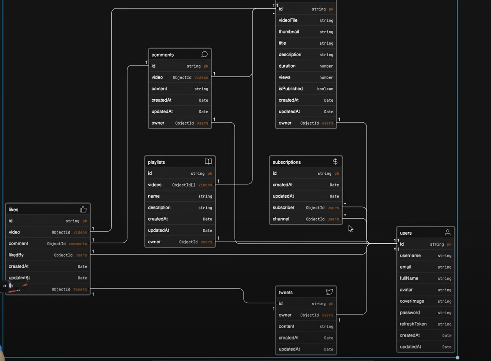

# Comprehensive Backend Project

## PlayTube

### Design Link (Figma)
[Figma-Design](https://www.figma.com/design/shmxWL5FKRO5GNOPPopBg6/PLAY?node-id=0-1)

### erasor link
[Models-mapping](https://app.eraser.io/workspace/YtPqZ1VogxGy1jzIDkzj)

Data models of the project
We can even make this model our way. It depend on future scope and requirmenet so focus on functionality if that works thats file as well

### Git (source code)
[Github-Hitesh_Choudhary](https://github.com/hiteshchoudhary/chai-backend)

## Notes Index
